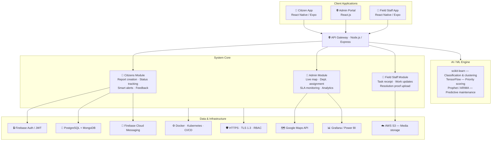

<div align="center">

# 🏙️ NagarNigrani

**Smart Civic Issue Reporting Platform**

[](#)
[](#)
[](#)
[](#)
[](#)

*Empowering citizens. Ensuring accountability. Building smarter cities.*

</div>

---

## 📑 Table of Contents

- [🚀 Problem Statement](#-problem-statement)
- [💡 Our Solution](#-our-solution)
- [📸 Screenshots](#-screenshots)
- [🛠️ Tech Stack](#️-tech-stack)
- [✅ Features](#-features)
- [📊 System Architecture](#-system-architecture)
- [📂 Project Structure](#-project-structure)
- [⚙️ Getting Started](#️-getting-started)
- [🧩 Roadmap](#-roadmap)
- [👨‍💻 Contributors](#-contributors)
- [📄 License](#-license)

---

## 🚀 Problem Statement

Urban civic issues like potholes, uncollected garbage, and broken streetlights are an everyday struggle for millions of citizens. Traditional reporting systems fail because they are:

- **Hard to access** for the average citizen.
- **Poorly tracked**, leaving users in the dark about their complaint status.
- **Slow to resolve** due to fragmented municipal workflows.
- **Lacking transparency** and accountability.

---

## 💡 Our Solution

**NagarNigrani** is a mobile-first civic engagement platform designed to bridge the gap between citizens and municipal authorities.

> **Vision:** To build a scalable, transparent, and intelligent civic issue management system that improves urban governance, boosts citizen participation, and holds authorities accountable.

### How It Helps

- 📱 **Seamless Reporting:** Submit complaints in under 30 seconds via mobile.
- 📍 **Geo-tagging:** Pinpoint exact locations for faster resolution.
- 📸 **Visual Evidence:** Attach images directly to reports.
- 🔔 **Real-Time Updates:** Track the lifecycle of a complaint from submission to resolution.

---

## 📸 Screenshots

> **🚀 UI Development in Progress!**
>
> We are currently polishing our React Native screens. High-fidelity screenshots of the NagarNigrani app interface — including the Dashboard, Live Map, and Report Creation flow — will be uploaded here shortly before the hackathon deadline.

---

## 🛠️ Tech Stack

### Frontend


### Backend & Database


### AI / ML


### DevOps


---

## ✅ Features

### 🔐 Authentication

- [x] Email/Password login & signup
- [x] Google Sign-In integration
- [x] Persistent login sessions via AsyncStorage

### 📱 User Interface

- [x] Custom, centralized theme system
- [x] Reusable UI components (e.g., `GradientButton`)
- [x] Developed Screens: Welcome, Login, Signup, Home, Dashboard, Profile, Leaderboard, Create Report

### 🔥 Cloud & Database

- [x] Firebase Firestore integration for complaints
- [x] Firebase Storage for image uploads
- [x] Firebase Authentication

### 🚧 Currently In Progress

- [ ] 📍 Complaint submission with live location & images
- [ ] 🗺️ Interactive map plotting reported issues
- [ ] 🔔 Push notifications via Firebase Cloud Messaging (FCM)
- [ ] 📊 Admin web dashboard for municipal authorities

---

## 📊 System Architecture

The platform is structured into four layers, each with a clear responsibility.



**How it flows:**

1. **Report** — Citizens submit issues via the mobile app with photo, voice, and GPS location.
2. **Process** — The API Gateway routes complaints to the relevant module; media is stored in S3, metadata in the database.
3. **Prioritise** — The AI/ML engine scores and classifies complaints, surfacing critical issues first.
4. **Route** — The admin dashboard assigns work orders to field staff by department and SLA.
5. **Resolve** — Field staff update status on-ground and upload proof; the citizen receives an FCM push notification.

---

## 📂 Project Structure

```text
src/
│   firebase.ts              # Firebase configuration
│   theme.ts                 # App theming & design tokens
│
├── auth/                    # Authentication logic
│       emailAuth.ts
│       googleAuth.ts
│
├── components/              # Reusable UI components
│       GradientButton.tsx
│
├── context/                 # Global state management
│       AuthContext.tsx
│
├── screens/                 # App screens
│       CreateReportScreen.tsx
│       DashboardScreen.tsx
│       HomeScreen.tsx
│       LeaderboardScreen.tsx
│       LoginScreen.tsx
│       ProfileScreen.tsx
│       SignupScreen.tsx
│       WelcomeScreen.tsx
│
├── hooks/                   # Custom React hooks
└── utils/                   # Utility/helper functions
```

---

## ⚙️ Getting Started

Follow these steps to set up the project locally on your machine.

### Prerequisites

- Node.js (v18 or higher)
- npm or yarn
- Expo CLI (`npm install -g expo-cli`)
- A Firebase project (see [Firebase Console](https://console.firebase.google.com/))

### 1. Clone the repository

```bash
git clone https://github.com/SachinManral/SIH-25.git
cd SIH-25
```

### 2. Install dependencies

```bash
npm install
```

### 3. Set up environment variables

Create a `.env` file in the root directory and add your Firebase credentials:

```env
EXPO_PUBLIC_FIREBASE_API_KEY=your_key
EXPO_PUBLIC_FIREBASE_AUTH_DOMAIN=your_domain
EXPO_PUBLIC_FIREBASE_PROJECT_ID=your_project
EXPO_PUBLIC_FIREBASE_STORAGE_BUCKET=your_bucket
EXPO_PUBLIC_FIREBASE_MESSAGING_SENDER_ID=your_sender_id
EXPO_PUBLIC_FIREBASE_APP_ID=your_app_id
```

> **🔐 Security Note:** API keys are stored using environment variables. Sensitive data must **never** be committed to the repository. Ensure `.env` is listed in your `.gitignore`.

### 4. Run the application

```bash
npx expo start
```

Scan the QR code with the **Expo Go** app on your phone, or press `a` for Android emulator / `i` for iOS simulator.

---

## 🧩 Roadmap (Future Enhancements)

- **🧠 AI Prioritization:** Machine learning models to auto-prioritize critical issues (e.g., a massive sinkhole vs. a broken bench).
- **⚙️ Predictive Maintenance:** Alerting authorities to fix infrastructure *before* it breaks entirely.
- **🎮 Gamification:** Reward points and local leaderboards for active, engaged citizens.
- **🎙️ Voice-Based Reporting:** Accessibility feature for visually impaired or elderly users.
- **🤝 NGO / CSR Integration:** Allowing third parties to adopt and fund the resolution of specific local issues.
- **📈 Analytics Dashboard:** City-wide heatmaps and trend reports for civic administrators.
- **📞 Communication Service:** Twilio/Exotel integration for SMS/IVR fallback (future scope).

---

## 📌 Context: Smart India Hackathon 2025

This project is being actively developed as a submission for **SIH 2025**, focusing on the theme of improving civic engagement and smart city infrastructure.

---

## 👨‍💻 Contributors

| Name | Role |
|---|---|
| **Sachin Manral** | Lead Developer |

Want to contribute? Feel free to open an issue or submit a pull request!

---

## 📄 License

This project is developed for academic and hackathon purposes and is licensed under the **MIT License**.

```
MIT License

Copyright (c) 2025 Sachin Manral

Permission is hereby granted, free of charge, to any person obtaining a copy
of this software and associated documentation files (the "Software"), to deal
in the Software without restriction, including without limitation the rights
to use, copy, modify, merge, publish, distribute, sublicense, and/or sell
copies of the Software, and to permit persons to whom the Software is
furnished to do so, subject to the following conditions:

The above copyright notice and this permission notice shall be included in all
copies or substantial portions of the Software.

THE SOFTWARE IS PROVIDED "AS IS", WITHOUT WARRANTY OF ANY KIND, EXPRESS OR
IMPLIED, INCLUDING BUT NOT LIMITED TO THE WARRANTIES OF MERCHANTABILITY,
FITNESS FOR A PARTICULAR PURPOSE AND NONINFRINGEMENT. IN NO EVENT SHALL THE
AUTHORS OR COPYRIGHT HOLDERS BE LIABLE FOR ANY CLAIM, DAMAGES OR OTHER
LIABILITY, WHETHER IN AN ACTION OF CONTRACT, TORT OR OTHERWISE, ARISING FROM,
OUT OF OR IN CONNECTION WITH THE SOFTWARE OR THE USE OR OTHER DEALINGS IN THE
SOFTWARE.
```

---

<div align="center">

Made with ❤️ for smarter, more accountable cities.

</div>
